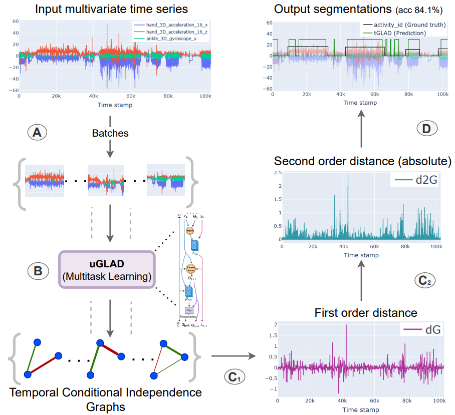

## Are uGLAD? Time will tell!  
### Introducing the `tGLAD` framework for multivariate time series segmentation  

we introduce a novel approach for multivariate time series segmentation using conditional independence (CI) graphs. CI graphs are probabilistic graphical models that represents the partial correlations between the nodes. We propose a domain agnostic multivariate segmentation framework `tGLAD` which draws a parallel between the CI graph nodes and the variables of the time series. If we apply the graph recovery model `uGLAD` to a short interval of the time series, it will result in a CI graph that shows partial correlations among the variables. We extend this to the time series by utilizing a sliding window to create a batch of intervals and then run a single `uGLAD` model in multitask learning mode to recover all the CI graphs simultaneously. As a result, we obtain a corresponding temporal CI graphs representation of the multivariate time series. We then designed a trajectory tracking algorithm to study the evolution of these graphs across distinct intervals to determine a suitable segmentation. `tGLAD` provides a competitive time complexity of $O(N)$ for settings where number of variables D<<N. 
 
### High level overview  

   

  

**tGLAD framework.** (A) The time series is divided into multiple intervals
by using a sliding window to create a batch of intervals. (B) Run a single
uGLAD model in multitask learning (or batch) mode setting to recover a CI graph
for every input batch. This gives a corresponding set of temporal CI graphs. The
entire input is processed in a single step as opposed to obtaining a CI graph
for each interval individually. (C1) Get the first order distance, `dG` sequence, of
the temporal CI graphs which captures the distance between the consecutive
graphs. This is supposed to give higher values at the segmentation points. (C2)
Again take a first order distance of the sequence in the previous step and then
its absolute value to get `d2G` sequence, which further accentuates the values at
the segmentation points. (D) Apply a threshold to zero out the smaller values of
`d2G` and identify the segmentation blocks using an `Allocation' algorithm.

## Setup  
The `setup.sh` file contains the complete procedure of creating a conda environment for `tGLAD` model. Run the command `bash setup.sh`    
In case of dependencies conflict, one can alternatively use this command `conda env create --name tGLAD --file=environment.yml`.  

## demo     
A minimalist working example of `tGLAD` is given in `demo_tglad.ipynb`.

## Citation
If you find this method useful, kindly cite the following related papers:
- `Are uGLAD? Time will tell!`: [arxiv](<https://arxiv.org/abs/2303.11647>)  

@article{}  

- `uGLAD`: Sparse graph recovery by optimizing deep unrolled networks. [arxiv](<https://arxiv.org/abs/2205.11610>)  

@inproceedings{  
shrivastava2022a,   
title={A deep learning approach to recover conditional independence graphs},  
author={Harsh Shrivastava and Urszula Chajewska and Robin Abraham and Xinshi Chen},  
booktitle={NeurIPS 2022 Workshop: New Frontiers in Graph Learning},  
year={2022},  
url={https://openreview.net/forum?id=kEwzoI3Am4c}  
}  

